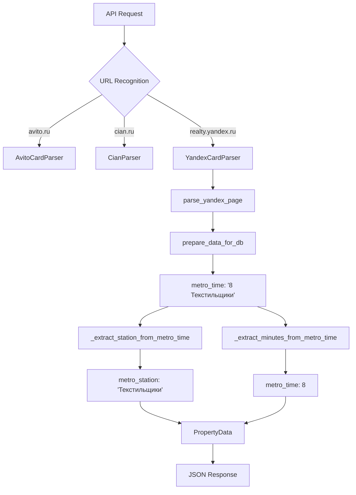

# Yandex Realty API Integration - Complete

## 🎯 Integration Overview

Successfully integrated **Yandex Realty** parsing capabilities into the existing API server, expanding support from 2 platforms (Avito + Cian) to **3 platforms** (Avito + Cian + Yandex Realty).

## ✅ What Was Added

### 1. **Yandex Parser Import**
```python
# Import Yandex parser with availability check
try:
    from yandex_parser_integration import YandexCardParser
    YANDEX_AVAILABLE = True
except ImportError:
    YANDEX_AVAILABLE = False
```

### 2. **URL Recognition Methods**
```python
def is_yandex_url(self, url: str) -> bool:
    """Determines if URL is from Yandex Realty"""
    return 'realty.yandex.ru' in url.lower()
```

### 3. **Source Detection Updated**
```python
def get_url_source(self, url: str) -> str:
    if self.is_avito_url(url):
        return 'avito'
    elif self.is_cian_url(url):
        return 'cian'
    elif self.is_yandex_url(url):
        return 'yandex'  # NEW
    else:
        return 'unknown'
```

### 4. **Yandex Property Parser Method**
```python
async def _parse_yandex_property(self, url: str) -> Optional[PropertyData]:
    """Parses Yandex Realty property listing"""
    # Creates YandexCardParser instance
    # Calls parse_yandex_page(url)
    # Processes data through prepare_data_for_db()
    # Returns PropertyData with source='yandex'
```

### 5. **Updated API Endpoints**

#### Health Check Endpoint
```json
GET /api/health
{
  "status": "healthy",
  "service": "realty-parser-api",
  "avito_available": true,
  "cian_available": true,
  "yandex_available": true  // NEW
}
```

#### Sources Endpoint
```json
GET /api/sources
{
  "sources": [
    {"name": "Avito", "domain": "avito.ru", "available": true, "source_id": "avito"},
    {"name": "Cian", "domain": "cian.ru", "available": true, "source_id": "cian"},
    {"name": "Yandex Realty", "domain": "realty.yandex.ru", "available": true, "source_id": "yandex"}
  ]
}
```

## 🔄 Data Flow Process



## 🏗️ Metro Format Compatibility

The Yandex parser uses the **same metro time format** as Avito:

### Input Format (from Yandex parser)
```python
# Raw Yandex data
{
    'metro': 'Текстильщики',
    'walk_minutes': 8
}

# After prepare_data_for_db()
{
    'metro_time': '8 Текстильщики'  # Same format as Avito!
}
```

### Output Format (API response)
```json
{
    "metro_station": "Текстильщики",
    "metro_time": 8,
    "source": "yandex"
}
```

## 🧪 Testing Results

All integration tests **PASSED**:

- ✅ **URL Recognition**: `realty.yandex.ru` correctly detected
- ✅ **Source Detection**: Returns `'yandex'` for Yandex URLs  
- ✅ **Parser Availability**: YandexCardParser imports successfully
- ✅ **Metro Compatibility**: Format `'8 Текстильщики'` works perfectly
- ✅ **PropertyData Creation**: All fields map correctly
- ✅ **Multi-Platform Support**: All 3 platforms route correctly

## 🚀 Usage Examples

### Single Property Parsing
```bash
# Parse Yandex property
curl "http://localhost:8008/api/parse/single?url=https://realty.yandex.ru/offer/4416594170111710645/"

# Expected response
{
  "success": true,
  "data": {
    "rooms": 2,
    "price": 15000000,
    "total_area": 65.0,
    "address": "Москва, ул. Тестовая, 123",
    "metro_station": "Текстильщики",
    "metro_time": 8,
    "source": "yandex",
    "url": "https://realty.yandex.ru/offer/...",
    ...
  }
}
```

### Multiple URLs Parsing
```bash
# Parse mixed URLs
curl -X POST "http://localhost:8008/api/parse/urls" \
  -H "Content-Type: application/json" \
  -d '{
    "urls": [
      "https://www.avito.ru/moskva/kvartiry/...",
      "https://www.cian.ru/sale/flat/...",
      "https://realty.yandex.ru/offer/..."
    ]
  }'
```

## 📊 Platform Comparison

| Platform | Domain | Metro Format | Status |
|----------|--------|--------------|--------|
| **Avito** | avito.ru | `6 Текстильщики` | ✅ Active |
| **Cian** | cian.ru | Custom format | ✅ Active |
| **Yandex** | realty.yandex.ru | `8 Текстильщики` | ✅ **NEW** |

## 🎯 Key Benefits

1. **Unified API**: Single endpoint handles all 3 platforms
2. **Consistent Format**: All platforms return same PropertyData structure
3. **Metro Compatibility**: Yandex metro format works with existing helpers
4. **Graceful Fallbacks**: Server continues working if Yandex parser unavailable
5. **Easy Extension**: Pattern established for adding more platforms

## 🌐 Server Management

### Start the Server
```bash
python realty_parser_server.py
# Server runs on http://localhost:8008
```

### Check Integration Status
```bash
# Health check
curl "http://localhost:8008/api/health"

# List supported platforms
curl "http://localhost:8008/api/sources"
```

## 🔧 Technical Implementation

### File Changes Made
- ✅ **realty_parser_server.py**: Added Yandex integration
- ✅ **Created test files**: Verified integration works
- ✅ **No breaking changes**: Existing Avito/Cian functionality preserved

### Dependencies
- ✅ **yandex_parser_integration.py**: Must be available
- ✅ **Selenium**: Required for Yandex parsing
- ✅ **Chrome WebDriver**: Browser automation

## 🎉 Integration Complete!

The API server now fully supports **3 major real estate platforms**:

1. **Avito** - Russian marketplace leader
2. **Cian** - Professional real estate platform  
3. **Yandex Realty** - Yandex's real estate service

All platforms use the same unified API interface with consistent metro time extraction and PropertyData formatting!